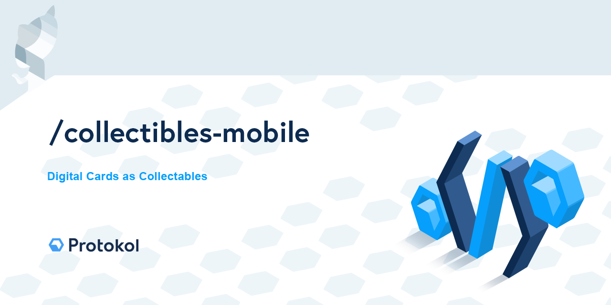

[](https://creativecommons.org/licenses/by-nc-sa/4.0/)

# Digital cards mobile app

A mobile app consuming a set of `@protokol` packages providing Digital Asset (NFT) Support. Supporting the following main features:

- wallet management
- digital card ownership

For more information and detailed documentation follow this link: https://docs.protokol.com/nft/.

This work is licensed under [Creative Commons Attribution-NonCommercial-ShareAlike 4.0 International License](https://creativecommons.org/licenses/by-nc-sa/4.0/).

## Production Install
App is available on:

- [Web](https://protokol.github.io/collectibles-mobile)
- [Android](https://protokol.github.io/collectibles-mobile)
- [iOS](https://protokol.github.io/collectibles-mobile)

[comment]: # (TODO: Replace Android and iOS links to Google Play & App Store)

## Source Install

Copy .env.template to .env and configure properly
Keep REACT_APP_PAPER_COINS_FAUCET_SENDER_PASSPHRASE empty to disable Faucet funcionality

Be sure you don't publish any passphrase for real money production environments

### Development Environment Setup

Run `npm start` for a dev server. The application will open in your default browser.

Run `cap:start:android` for a dev Android application. Running Android application requires Android Studio to be installed.
If you cant find the folder capacitor-cordova-android-plugins inside the android project folder, you need to run a capacitor command to create it (and update plugin variables): Run `npx cap sync`


Run `cap:start:ios` for a dev iOS application. Running iOS application requires XCode to be installed. 

### Source Code Setup

```bash
git clone https://github.com/protokol/collectibles-mobile
cd collectibles-mobile

# run npm install from root folder
npm install

# install ionic cli tool
npm install -g @ionic/cli
```

#### Running on Android SDK  
Create, if not exists, local.properties file at android folder with next line:  
sdk.dir=[path to ANDROID SDK FOLDER]

```
npm run build:android:ci  (Windows users: npm run win:build:android:ci)
npm run cap:start:android
```
#### Running Unit Tests

Run `npm run test` to execute the unit tests via [Jest](https://jestjs.io/).

# Contact Us For Support And Custom Development

info@protokol.com

# License

[](https://creativecommons.org/licenses/by-nc-sa/4.0/)

This work is licensed under [Creative Commons Attribution-NonCommercial-ShareAlike 4.0 International License](https://creativecommons.org/licenses/by-nc-sa/4.0/), under the following terms:

#### Attribution

You must give appropriate credit, provide a link to the license, and indicate if changes were made. You may do so in any reasonable manner, but not in any way that suggests the licensor endorses you or your use.

#### NonCommercial

You may not use the material for commercial purposes. For commercial purposes please reach out to info@protokol.com.

#### ShareAlike

If you remix, transform, or build upon the material, you must distribute your contributions under the same license as the original.

#### Legal code

Read the rest of the obligatory [license legal code](https://creativecommons.org/licenses/by-nc-sa/4.0/legalcode).

Copyright (c) Protokol.com 2020
